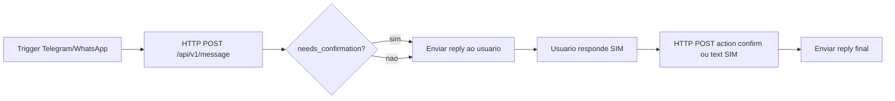

# Integração n8n + Assistente Planilha

O n8n recebe mensagens (WhatsApp, Telegram, etc.) e chama esta API Python, que usa o **mesmo parser e a mesma planilha** do app e do bot Telegram.

## 1. Subir a API

1. Confirme `WORKBOOK_PATH` no `.env` (planilha em `dist_novo\AssistentePlanilha\...`).
2. Duplo clique em **`iniciar_n8n_api.bat`** ou:

```powershell
cd "C:\Users\Usuario\Desktop\DEV - PROJETOS\assistente-planilha-1"
.\.venv_native\Scripts\python.exe n8n_api.py
```

3. Abra a documentação interativa: **http://127.0.0.1:8765/docs**

## 2. Endpoints

| Método | URL | Uso |
|--------|-----|-----|
| GET | `/health` | Testa se a planilha foi encontrada |
| POST | `/api/v1/message` | Envia texto / confirma / cancela |
| POST | `/api/v1/transcribe` | Áudio → texto (Whisper) |
| DELETE | `/api/v1/session/{id}` | Limpa prévia pendente |

### POST `/api/v1/message` (corpo JSON)

```json
{
  "conversation_id": "whatsapp:5511999999999",
  "text": "Resumo",
  "channel": "whatsapp"
}
```

| Campo | Descrição |
|-------|-----------|
| `conversation_id` | ID único por usuário/canal (obrigatório para prévia + SIM) |
| `text` | Mensagem do usuário |
| `channel` | `whatsapp`, `telegram` ou `n8n` (só para log na planilha) |
| `action` | Opcional: `confirm` ou `cancel` |

**Resposta:**

```json
{
  "ok": true,
  "conversation_id": "whatsapp:5511999999999",
  "reply": "texto para enviar de volta ao usuário",
  "needs_confirmation": true,
  "applied": false,
  "preview": "..."
}
```

- `needs_confirmation: true` → usuário deve responder **SIM** (mesmo endpoint, mesmo `conversation_id`).
- Comandos **Resumo**, **Status**, **Prévia** → `applied: true` imediato, sem confirmação.

### Autenticação (recomendado em produção)

No `.env`, defina `N8N_API_KEY=sua_senha`.

No n8n, no nó **HTTP Request**, adicione header:

- Nome: `X-API-Key`
- Valor: `sua_senha`

## 3. Fluxo no n8n (Telegram ou WhatsApp)



### Nó HTTP Request (exemplo)

- **Method:** POST  
- **URL:** `http://127.0.0.1:8765/api/v1/message`  
  - Se o n8n estiver em **Docker** no Windows: `http://host.docker.internal:8765/api/v1/message`
- **Body:** JSON  
- **JSON:**

```json
{
  "conversation_id": "{{ $json.channel }}:{{ $json.chatId }}",
  "text": "{{ $json.messageText }}",
  "channel": "{{ $json.channel }}"
}
```

(Ajuste os campos conforme o trigger do seu provedor.)

### Responder ao usuário

Use o campo `reply` da resposta no nó seguinte (Telegram Send Message / WhatsApp).

### Confirmação

Quando `needs_confirmation` for `true`, na próxima mensagem do mesmo usuário:

- Envie `text: "SIM"` **ou** `action: "confirm"` no JSON.

Para cancelar: `text: "NAO"` ou `action: "cancel"`.

## 4. Áudio no n8n

1. Baixe o arquivo de áudio no fluxo (HTTP Request / nó do provedor).
2. POST **`/api/v1/transcribe`** com **multipart** campo `file`.
3. Use o `text` retornado no próximo POST `/api/v1/message`.

## 5. Rodar junto com o projeto

| Serviço | Script | Porta |
|---------|--------|-------|
| App Streamlit | `iniciar_app.bat` | 8501 |
| API n8n | `iniciar_n8n_api.bat` | 8765 |
| Bot Telegram (opcional) | `run_telegram_bot.ps1` | — |

Você pode usar **só o n8n** para Telegram/WhatsApp e desligar o `telegram_bot.py`, desde que todos os fluxos passem pela API.

## 6. Instalar o n8n (opcional)

```powershell
winget install n8n.n8n
```

Ou Docker: `docker run -it --rm -p 5678:5678 -v n8n_data:/home/node/.n8n n8nio/n8n`

Acesse **http://localhost:5678** e importe o workflow de exemplo em `n8n/workflow-exemplo-telegram.json` (ajuste URL e credenciais).
